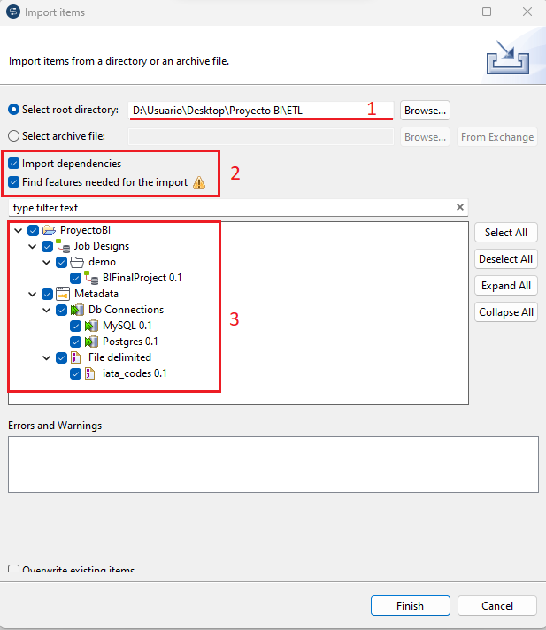

<h1>Proyecto final BI
</h1>
El presente repositorio contiene el proyecto final de la materia de Fundamentos de Inteligencia de Negocios, el cual consiste en la creación de un proceso ETL.


<h2>Contenido</h2>

- [Definición del proyecto](#definición-del-proyecto)
- [Requerimientos de software](#requerimientos-de-software)
- [Configuración de bases de datos](#configuración-de-bases-de-datos)
  - [Configuración manual](#configuración-manual)
  - [Configuración con Docker](#configuración-con-docker)
  - [Creación de data inicial](#creación-de-data-inicial)
- [Pasos para la ejecución del ETL](#pasos-para-la-ejecución-del-etl)
- [Importar ETL como job en Talend Open Studio](#importar-etl-como-job-en-talend-open-studio)

## Definición del proyecto
La empresa DataFast desea conocer sus habilidades en procesamientos de datos haciendo uso de la
herramienta Talend Studio, por lo que ha definido el siguiente problema:

Existen dos bases de datos relacionales, una base de datos utilizando MySQL que contiene la información de los aviones disponibles en la empresa (tabla `airplane`) y la otra base de datos usando PostgreSQL que contiene la información de los vuelos realizados por la empresa (tabla `flight`).

Por motivos de inteligencia de negocios, se solicita generar un reporte en formato CSV sobre las millas totales que han sido realizadas por cada vuelo en el mismo avión y que tienen el mismo lugar de origen y destino.

Por ejemplo si se tiene la siguiente información en las tablas `airplane` y `flight`:
- Tabla `airplane`

- Tabla `flight`


Luego de ejecutar el proceso ETL, la información del archivo de salida debe ser la siguiente:


## Requerimientos de software
- Java JDK v17.0.7
- Talend Open Studio v8.0.1
- MySQL 8 (En caso de no usar docker)
- PostgreSQL 15 (En caso de no usar docker)

## Configuración de bases de datos
Para la realización de este proceso ETL se hacen uso de dos bases de datos, una base de datos PostgreSQL y una base de datos MySQL. Para dicha configuración se plantean dos alternativas:

### Configuración manual 
Si deseas configurar manualmente las bases de datos debes de haber instalado las versiones de MySQL y postgreSQL definidas en los [requerimientos de software](#requerimientos-de-software).

La definición y configuración de las bases de datos debe cumplir con los siguientes parametros:

|         | MySQL      | PostgreSQL |
|---------|------------|------------|
| Host    | 127.0.0.1  | 127.0.0.1  |
| Puerto  | 3306       | 5432       |
| Usuario | Username   | Username   |
| Contraseña | Password! | Password! |
| Base de datos | company  | company  |
| Esquema | N/A        | detail     |
| tabla | airplane | flight | 

La tabla `airplane` de MySQL tiene la siguiente estructura:

| airplane | | | |
--|------|--|-
| id | integer | Identificador único de la tabla | Primary Key |
| code | varchar(6) | Codigo del aeroplano | |
| model | varchar(10) | Modelo del aeroplano | |
| year | integer | Año de fabricación | |


La tabla `flight` de PostgreSQL tiene la siguiente estructura:

| airplane | | | |
--|------|--|-
| id | integer | Identificador único de la tabla | Primary Key |
| airplane | integer | Identificador único de la tabla `airplane` | Foreign key |
| origin | varchar(3) | Origen de salida del vuelo | |
| destination | varchar(3) | Destino de llegada del vuelo | |
| departure | timestamp | Fecha de salida | |
| arrival | timestamp | Fecha de arribo | |
| flightMiles | decimal | Total de millas voladas en el trayecto | |

Los scripts para la creación de tablas de [MySQL](/Databases/mysql-init.sql) y [PostgreSQL](/Databases/postgres-init.sql) se encuentran en la carpeta [Databases](/Databases/). Los scripts para la inserción de datos de [MySQL](/Databases/inserts/airplanes.sql) y [PostgreSQL](/Databases/inserts/flights.sql) se encuentran en la carpeta [inserts](/Databases/inserts/).
### Configuración con Docker
Si no deseas instalar localmente las bases de datos de MySQL y PostgreSQL, ni tampoco realizar la definición de las bases de datos y tampoco la inserción de datos, entonces puedes utilizar `docker compose` para realizar todo este proceso de forma automatica.

Los pasos a realizar son los siguientes:

1. Abre la terminal de tu preferencia
2. Navega hasta la carpeta [Databases](Databases/).
3. Ejecuta el comando
```bash
docker compose up -d
```
Esto inicia y ejecuta los servicios definidos en el archivo docker-compose.yml en segundo plano (modo "detached"), creando así una instancia de MySQL y PostgreSQL con sus respectivas bases de datos, tablas y esquemas.

Los scripts para la inserción de datos de [MySQL](/Databases/inserts/airplanes.sql) y [PostgreSQL](/Databases/inserts/flights.sql) se encuentran en la carpeta [inserts](/Databases/inserts/).

### Creación de data inicial

Si deseas crear data inicial distinta a la que se encuentra en este repositorio, ya sea porque necesitas una mayor cantidad de información o por cualquier otro motivo, puedes revisar la documentación del repositorio [BI-Final-Project-DML-Generator](https://github.com/kevocodes/BI-Final-Project-DML-Generator), el cual es un proyecto realizado con `Node JS` para generar la data inicial que necesitan las bases de datos en este proceso ETL.

## Pasos para la ejecución del ETL
Para ejecutar el proceso ETL debes seguir los siguientes pasos:

1. Abrir el proyecto con el explorador de archivos y ejecuta el script [move-iata-codes.bat](move-iata-codes.bat) como administrador. Esto moverá el archivo CSV [IATA codes.csv](Resources/IATA%20Codes.csv) hacia el disco local `C:\` (indispensable para el funcionamiento del ETL)
2. Luego dirigirte desde la terminal hasta la carpeta [./ETL/BIFinalProject](ETL/BIFinalProject/)
3. Ejecutar el script [BIFinalProject_run.bat](ETL/BIFinalProject/BIFinalProject_run.bat)

Como resultado se creará un archivo CSV en la ruta `C:\Program Files (x86)\TOS_DI-8.0.1\studio\workspace\total_de_millas_voladas_por_vuelo.csv` el cual tendrá el reporte de las millas totales que han sido realizadas por cada vuelo en el mismo avión y que tienen el mismo lugar de origen y destino.

## Importar ETL como job en Talend Open Studio

Para importar el proceso ETL para poder editarlo en Talend Open Studio debes realizar los siguientes pasos:

1. Abrir Talend Open Studio y en el menu lateral izquierdo dar click derecho al apartado `Job Designs` y luego dar click a la opción `import items`


2. Se abrirá la ventana de `import items` en la cual primero debes de seleccionar la carpeta que contiene el proyecto (en este caso la carpeta [ETL](ETL/)), luego debes asegurarte de tener seleccionadas las opciones `import dependencies` y `find features needed for the import`. Para finalizar debes seleccionar todos los elementos a importar y das click en el botón `finish`.



Si realizaste correctamente los pasos anteriores habrás importado el proyecto en Talend Open Studio satisfactoriamente


